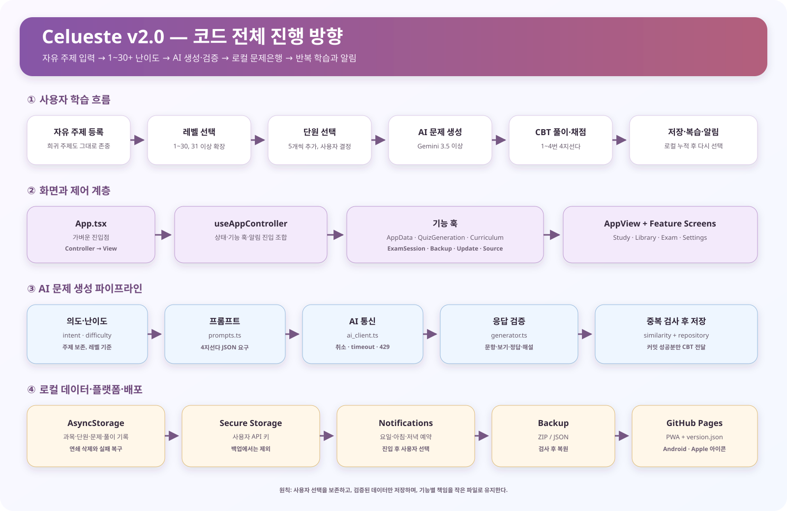
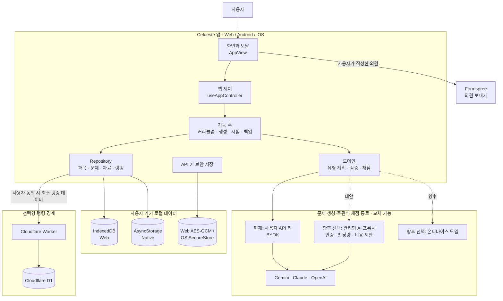

# Celueste v2.4 아키텍처와 워크플로

이 문서는 로컬 `main`에 통합된 v2.4 Beta 후보 코드의 상세 구조와 실행 흐름을 기록합니다. 배포 버전 표시는 아직 v2.3.4이며, 이 문서의 v2.4는 **현재 개발 아키텍처 기준**을 뜻합니다.



## 1. 문서 권한과 불변 원칙

- 개발 시작점은 루트 `DEVELOPER.md`입니다.
- 변경할 수 없는 제품 헌법과 개발 안전 규칙은 루트 `AGENTS.md`가 최우선입니다.
- 이 문서는 코드 계층, 실행 흐름, 외부 연결, 실패 처리를 설명합니다.
- 제품 일정과 미완료 항목은 `PRODUCT_ROADMAP_AND_BETA_PLAN.md`에서 관리합니다.

핵심 원칙은 자유 주제 지원, 가짜 문제 금지, 로컬 퍼스트, 도메인 고정, 중복 방지, 사용자 주도 난이도, 모바일 16px 입력, 관심사 분리입니다. 객관식 정답 위치 분산과 문항 유형 추첨은 별도 단계입니다.

## 2. 전체 계층 구조

GitHub에서는 아래 Mermaid 블록이 아키텍처 그림으로 렌더링됩니다.



핵심 경계는 다음과 같습니다.

- 학습 데이터의 기준 저장소는 사용자 기기입니다.
- 문제 생성 통로는 교체 가능하며 앱 내부에 운영자 비밀키를 포함하지 않습니다.
- 랭킹 서버는 문제 생성 서버가 아니며 문제·교재·API 키를 받지 않습니다.
- 외부 전송은 해당 기능을 사용자가 실행하거나 동의했을 때만 발생합니다.

```text
App.tsx
  └─ AppView + useAppController
       ├─ 화면/모달/시험 오버레이
       ├─ 기능 훅
       │    ├─ 커리큘럼
       │    ├─ 문제 생성
       │    ├─ 시험 세션
       │    └─ 백업·설정·알림
       ├─ domain
       │    ├─ 의도·난이도·프롬프트
       │    ├─ 문항 유형 계획·검증·생성
       │    ├─ 객관식 정답 위치 분산
       │    └─ 유형별 채점
       └─ repository → app_storage
            ├─ IndexedDB (Web)
            └─ AsyncStorage (Native)
```

| 계층 | 주요 파일 | 책임 |
| --- | --- | --- |
| 진입·화면 조합 | `App.tsx`, `src/components/AppView.tsx` | 화면, 모달, 전체화면 시험 오버레이 조합 |
| 앱 제어 | `src/hooks/useAppController.ts` | 화면 상태와 기능 훅 연결 |
| 페이징 | `src/hooks/useBookPagerGesture.ts` | 메인·자료함·설정 이동과 모바일 뷰포트 보호 |
| 커리큘럼 | `src/hooks/useCurriculumManager.ts` | 5단계 생성, 30단계 확장, 중복 정리 |
| 문제 생성 | `src/hooks/useQuizGeneration.ts` | 생성 요청, 저장, 시험 시작 조정 |
| 출제 도메인 | `src/domain/question_type_plan.ts`, `prompts.ts`, `generator_validation.ts`, `generator.ts` | 유형 추첨, 프롬프트, 검증, 모델 변환 |
| 정답 분산 | `src/domain/question_distribution.ts` | 객관식 정답 위치 Fisher-Yates 분산과 연속 번호 방지 |
| 채점 | `src/domain/grading.ts` | 객관식·빈칸 로컬 판정, 단답·서술 AI 판정 |
| 시험 | `src/features/exam/*` | 답안 입력, 풀이공간, 제출, 결과·해설 |
| 저장 | `src/data/app_storage.ts`, `src/data/db.ts`, `src/data/repositories/*` | 로컬 저장, 이관, 연쇄 삭제, 백업·복원 |
| 외부 연결 | `src/domain/ai_client.ts`, `src/domain/ranking_client.ts`, `src/integrations/*`, `apps/ranking-worker/` | AI, 보안 키, 랭킹, 의견 전송 |

`App.tsx`에는 도메인 로직을 추가하지 않습니다. 화면은 저장소와 외부 API를 직접 호출하지 않고 기능 훅과 repository 경계를 거칩니다.

## 3. 학습 생성 흐름

1. 사용자가 과목, 자료, 시작 난이도를 정합니다.
2. 커리큘럼 훅이 5개 단원을 만들고 필요할 때 30단계까지 확장합니다.
3. 사용자가 단원, 문항 수, 레벨, 기존 문제 유지 여부를 선택합니다.
4. `createQuestionTypePlan()`이 문항마다 객관식·주관식 범주·빈칸형을 독립 추첨합니다.
5. 주관식 범주가 선택되면 단답형과 서술형을 다시 같은 확률로 추첨합니다.
6. `prompts.ts`가 정확한 유형 순서, 학습 범위, 난이도, 기존 문제를 AI에 전달합니다.
7. `generator_validation.ts`가 유형별 필수 필드와 값 범위를 검사합니다.
8. AI가 반환한 유형 배열이 계획과 다르면 저장하지 않습니다.
9. 객관식 정답 위치를 분산한 뒤 전체 문항 순서를 다시 섞습니다.
10. 유사도 검사와 로컬 저장이 성공한 문제만 CBT로 전달합니다.

유형 비율을 강제로 보정하지 않으므로 3문항이 모두 같은 유형일 수 있습니다. API 키가 없거나 생성이 실패하면 가짜 문제로 대체하지 않습니다.

## 4. 시험·채점 흐름

| 유형 | 입력 | 판정 |
| --- | --- | --- |
| `multiple_choice` | 보기 선택 | 저장된 정답 옵션 ID와 로컬 비교 |
| `cloze` | 빈칸별 텍스트 | 허용 답안을 정규화해 로컬 비교, 빈칸별 부분 점수 |
| `short_answer` | 단답 텍스트 | AI가 모범답안의 핵심 의미 일치를 0/100으로 판정 |
| `essay` | 서술 텍스트 | AI가 2~5개 체크리스트별 충족 여부와 배점 반환 |

시험은 최상위 오버레이로 열려 기존 3페이지 뷰가 unmount되지 않습니다. 풀이공간은 문제별로 열고 닫을 수 있으며 연속 필기, 마지막 획 되돌리기, 전체 지우기를 제공합니다. 문제를 이동하면 이전 문제의 임시 필기를 다음 문제로 넘기지 않습니다.

주관식 채점 실패 시 사용자 답안과 고정 안내는 보존하지만 현재 자동 재시도·재채점 UI는 없습니다. 이 상태를 정상 오답과 구분하는 개선이 Beta 우선 과제입니다.

## 5. 자료와 개인정보 경계

- 과목, 단원, 문제, 오답, 알람, 설정은 기기 로컬에 저장합니다.
- API 키는 학습 데이터와 분리된 보안 저장 경로를 사용하며 백업에 포함하지 않습니다.
- 텍스트 자료는 과목과 명시적으로 연결된 본문만 생성 근거로 사용합니다.
- PDF 원본 바이트는 메모리에서 선택 구간 처리에만 사용하고 영구 저장하지 않습니다.
- PDF 메타데이터와 과목 연결은 저장하지만 새로고침 뒤 원문이 필요하면 사용자가 파일을 다시 선택합니다.
- 백업은 학습 데이터와 알람 설정을 포함하고, 랭킹 복구 토큰 외의 외부 비밀값은 포함하지 않습니다.

## 6. 저장·복원 흐름

- 웹 최초 실행 시 구형 AsyncStorage/localStorage 값을 IndexedDB로 복사하고 검증한 뒤 전환합니다.
- 이관 실패 시 구형 데이터를 삭제하지 않고 기존 경로를 유지합니다.
- repository는 관련 레코드 스냅샷을 확보한 뒤 순차 변경하고 실패 시 복구를 시도합니다.
- 단원·과목 삭제는 연결 문제까지 같은 책임 범위에서 처리합니다.
- 복원은 지원 스키마를 확인한 뒤 반영하며 API 키는 덮어쓰지 않습니다.
- 중첩 객체의 세밀한 런타임 검증 강화는 남은 과제입니다.

## 7. 알람 흐름

알람 스키마는 `schemaVersion: 2`이며 공통 요일과 최대 8개 시간을 사용합니다. 구형 아침/저녁 설정과 단일 시간 설정은 `normalizeAlarmConfig()`가 현재 형식으로 읽습니다.

- 네이티브: 선택 요일과 각 시간 조합으로 로컬 알림 예약
- 웹: 앱이 열려 있을 때 주기적으로 현재 시간을 확인하는 인앱 알림
- 알림 진입: 특정 문제를 자동 시작하지 않고 사용자가 과목과 단원을 선택

## 8. 외부 네트워크 경계

| 기능 | 전송 범위 | 현재 상태 |
| --- | --- | --- |
| AI 생성·채점·힌트 | 선택 과목·단원·자료 구간·문제·답안 중 요청에 필요한 내용 | 사용자 API 키 기반 |
| 의견 보내기 | 사용자가 작성한 문의와 필요한 앱 정보 | Formspree, 중복 잠금·20초 제한 |
| 선택형 랭킹 | 동의한 사용자의 최소 식별자와 집계 점수 | Worker/D1 구조 구현, 운영 URL·D1 설정 확정 필요 |
| 업데이트 확인 | 현재 버전 비교에 필요한 버전 정보 | 사용자가 갱신 확인 실행 |

랭킹은 문제 내용, 개인 교재, API 키를 보내지 않습니다. 운영 배포 전 `ranking_client.ts`의 개발 주소와 Worker의 D1 바인딩을 운영값으로 바꿔 검증해야 합니다.

## 9. 실패 처리 기준

| 상황 | 처리 |
| --- | --- |
| API 키 없음 | `NEEDS_CONNECTION` 또는 연결 안내, 가짜 문제 금지 |
| 생성 취소·시간 초과 | 저장과 시험 시작 차단, 명시적 안내 |
| 잘못된 JSON·유형 불일치 | 문제를 저장하지 않음 |
| 중복 문제만 생성 | 빈 시험을 시작하지 않음 |
| 저장 실패 | 성공으로 표시하지 않고 가능한 범위에서 복구 |
| 주관식 채점 실패 | 제출 답안 보존, 고정 실패 안내, 자동 재시도 없음 |
| 대용량 PDF | 구간을 줄여 다시 선택하도록 안내 |

## 10. UI와 접근성 원칙

- 연분홍 배경과 단일 백색 패널, 1px 구분선을 기본 골격으로 사용합니다.
- 중앙 책과 `Celueste` 문자는 낮은 불투명도의 워터마크로 사용합니다.
- 주요 행동은 분홍, 보조 추가 행동은 민트로 구분합니다.
- 모든 입력은 모바일 강제 확대 방지를 위해 16px 이상을 유지합니다.
- 접이식 행 전체를 누를 수 있게 하되 작은 화살표로 상태를 알립니다.
- `designTokens.ts` 토큰을 우선 사용하고 화면별 임의 색상·간격을 늘리지 않습니다.

## 11. 검증과 배포

1. 변경 범위 테스트
2. `cmd.exe /c npx tsc --noEmit`
3. 사용자 승인 후 `main` 커밋·푸시
4. 별도 배포 승인 후 `deploy-gh-pages.ps1`
5. 실주소, `version.json`, manifest, 아이콘 확인

일반 `main` 푸시와 `gh-pages` 배포는 서로 다른 작업입니다. 현재 릴리스 표기는 v2.3.4이므로 Beta 배포 전 `buildInfo.ts`, `CHANGELOG.md`, 태그를 함께 맞춥니다.

## 12. 다음 우선순위

1. 주관식 채점 실패를 오답과 분리하고 재채점 경로 제공
2. 랭킹 Worker 운영 URL·D1·개인정보 고지 확정
3. 실제 모바일 브라우저 E2E와 백업 복원 회귀 시나리오 추가
4. 병렬 AI 채점의 호출 제한·비용 관찰과 제어
5. 중첩 백업 스키마 검증 강화
6. 큰 파일의 책임 경계 재점검과 선택적 분리
