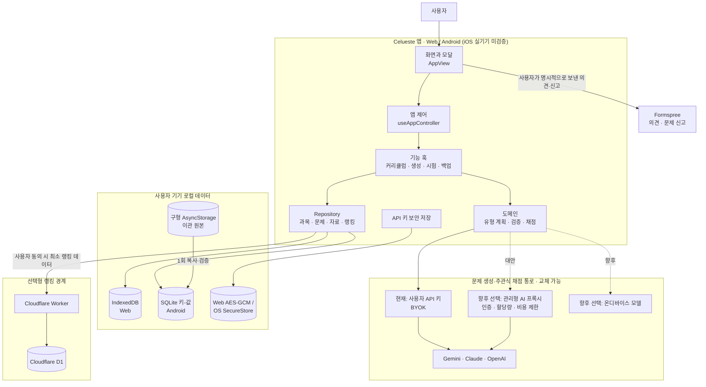

# Celueste 현재 아키텍처와 워크플로

이 문서는 2026-09-25 `feature/android-app`의 Android 테스트 코드를 기준으로 합니다. 공개 웹 `main`과 `gh-pages`는 별도 브랜치·배포 단계이며 Android 변경이 자동 반영되지 않습니다. 테스트 APK의 표시 버전은 2.3.6이고 첫 정식 출시 버전은 아직 정해진 코드에 반영되지 않았습니다.


## 1. 문서 권한과 불변 원칙

- 개발 시작점은 루트 `DEVELOPER.md`입니다.
- 변경할 수 없는 제품 헌법과 개발 안전 규칙은 루트 `AGENTS.md`가 최우선입니다.
- 이 문서는 코드 계층, 실행 흐름, 외부 연결, 실패 처리를 설명합니다.
- 제품 일정과 미완료 항목은 `PRODUCT_ROADMAP_AND_BETA_PLAN.md`에서 관리합니다.

핵심 원칙은 자유 주제 지원, 가짜 문제 금지, 로컬 퍼스트, 도메인 고정, 중복 방지, 사용자 주도 난이도, 모바일 16px 입력, 관심사 분리입니다. 객관식 정답 위치 분산과 문항 유형 추첨은 별도 단계입니다.

## 2. 전체 계층 구조

GitHub에서는 아래 Mermaid 블록이 아키텍처 그림으로 렌더링됩니다.



핵심 경계는 다음과 같습니다.

- 학습 데이터의 기준 저장소는 사용자 기기입니다.
- 문제 생성 통로는 교체 가능하며 앱 내부에 운영자 비밀키를 포함하지 않습니다.
- 랭킹 서버는 문제 생성 서버가 아니며 문제·교재·API 키를 받지 않습니다.
- 외부 전송은 해당 기능을 사용자가 실행하거나 동의했을 때만 발생합니다.

```text
App.tsx
  └─ AppView + useAppController
       ├─ 화면/모달/시험 오버레이
       ├─ 기능 훅
       │    ├─ 커리큘럼
       │    ├─ 문제 생성
       │    ├─ 시험 세션
       │    └─ 백업·설정·알림
       ├─ domain
       │    ├─ 의도·난이도·프롬프트
       │    ├─ 문항 유형 계획·검증·생성
       │    ├─ 객관식 정답 위치 분산
       │    └─ 유형별 채점
       └─ repository → app_storage
            ├─ IndexedDB (Web)
            └─ SQLite 키-값 (Android) ← 구형 AsyncStorage 이관
```

| 계층 | 주요 파일 | 책임 |
| --- | --- | --- |
| 진입·화면 조합 | `App.tsx`, `src/components/AppView.tsx` | 화면, 모달, 전체화면 시험 오버레이 조합 |
| 앱 제어 | `src/hooks/useAppController.ts` | 화면 상태와 기능 훅 연결 |
| 페이징 | `src/hooks/useBookPagerGesture.ts` | 메인·자료함·설정 이동과 모바일 뷰포트 보호 |
| 커리큘럼 | `src/hooks/useCurriculumManager.ts` | 5단계 생성, 30단계 확장, 중복 정리 |
| 문제 생성 | `src/hooks/useQuizGeneration.ts` | 생성 요청, 저장, 시험 시작 조정 |
| 출제 도메인 | `src/domain/question_type_plan.ts`, `prompts.ts`, `generator_validation.ts`, `subjective_suitability.ts`, `generator.ts` | 유형 선택·계획, 객관적 주관식 검사, AI 응답 검증 |
| 정답 분산 | `src/domain/question_distribution.ts` | 객관식 정답 위치 Fisher-Yates 분산과 연속 번호 방지 |
| 채점 | `src/domain/grading.ts` | 객관식·빈칸 로컬 판정, 단답·서술 AI 판정 |
| 시험 | `src/features/exam/*` | 답안 입력, 풀이공간, 제출, 결과·해설 |
| 저장 | `src/data/app_storage.ts`, `src/data/native_sqlite_backend.ts`, `src/data/native_storage_migration.ts`, `src/data/db.ts`, `src/data/repositories/*` | 웹 IndexedDB·Android SQLite, 구형 데이터 이관, 연쇄 삭제, 백업·복원 |
| 외부 연결 | `src/domain/ai_client.ts`, `src/domain/ranking_client.ts`, `src/integrations/*`, `apps/ranking-worker/` | AI, 보안 키, 랭킹, 의견 전송 |

`App.tsx`에는 도메인 로직을 추가하지 않습니다. 학습 화면은 기능 훅과 repository 경계를 따릅니다. 현재 의견·문제 신고 모달은 공용 `postFeedback()`을 화면에서 직접 호출하는 예외이며, 이 경계를 아키텍처 전체의 절대 보장으로 표현하지 않습니다.

## 3. 학습 생성 흐름

1. 사용자가 과목, 자료, 시작 난이도를 정합니다.
2. 커리큘럼 훅이 5개 단원을 만들고 필요할 때 30단계까지 확장합니다.
3. 사용자가 단원, 문항 수, 레벨, 문제 유형(혼합·객관식만·주관식만), 기존 문제 유지 여부를 선택합니다.
4. `createQuestionTypePlan()`이 선택 모드에 맞게 유형을 계획합니다. 혼합은 객관식·주관식 범주·빈칸형을 독립 추첨하고, 주관식만은 빈칸형을 제외합니다.
5. 주관식 범주가 선택되면 단답형과 서술형을 다시 같은 확률로 추첨합니다.
6. `prompts.ts`가 정확한 유형 순서, 학습 범위, 난이도, 기존 문제를 AI에 전달합니다.
7. `generator_validation.ts`가 유형별 필수 필드와 값 범위를 검사합니다.
8. AI가 반환한 유형 배열이 계획과 다르면 저장하지 않습니다.
9. 주관식이 객관적으로 채점하기 어려운 의견형이면 같은 유형 계획으로 한 번만 다시 생성하고, 재발하면 저장하지 않습니다. 객관식 정답 위치를 분산한 뒤 전체 문항 순서를 다시 섞습니다.
10. 유사도 검사와 로컬 저장이 성공한 문제만 CBT로 전달합니다.

유형 비율을 강제로 보정하지 않으므로 3문항이 모두 같은 유형일 수 있습니다. API 키가 없거나 생성이 실패하면 가짜 문제로 대체하지 않습니다.

## 4. 시험·채점 흐름

| 유형 | 입력 | 판정 |
| --- | --- | --- |
| `multiple_choice` | 보기 선택 | 저장된 정답 옵션 ID와 로컬 비교 |
| `cloze` | 빈칸별 텍스트 | 허용 답안을 정규화해 로컬 비교, 빈칸별 부분 점수 |
| `short_answer` | 단답 텍스트 | AI가 모범답안의 핵심 의미 일치를 0/100으로 판정 |
| `essay` | 서술 텍스트 | AI가 2~5개 체크리스트별 충족 여부와 배점 반환 |

시험은 최상위 오버레이로 열려 기존 3페이지 뷰가 unmount되지 않습니다. 풀이공간은 문제별로 열고 닫을 수 있으며 연속 필기, 마지막 획 되돌리기, 전체 지우기를 제공합니다. 문제를 이동하면 이전 문제의 임시 필기를 다음 문제로 넘기지 않습니다.

주관식 채점 응답이 누락·중복·형식 오류이면 임의의 부분점수를 주지 않고 `채점 미완료`로 처리합니다. 답안은 보존하며 자동 재채점 UI는 없습니다. 총점은 채점 완료 문항의 부분점수를 포함한 평균이며 미완료 문항은 분모에서 제외합니다. 사용자는 결과 화면에서 복습·오답노트 판정을 정정할 수 있지만 원래 채점, 도전 통과, 랭킹에는 적용되지 않습니다.

## 5. 자료와 개인정보 경계

- 과목, 단원, 문제, 오답, 알람, 설정은 기기 로컬에 저장합니다.
- API 키는 학습 데이터와 분리된 보안 저장 경로를 사용하며 백업에 포함하지 않습니다.
- 텍스트 자료는 과목과 명시적으로 연결된 본문만 생성 근거로 사용합니다.
- PDF 원본 바이트는 메모리에서 선택 구간 처리에만 사용하고 영구 저장하지 않습니다.
- PDF 메타데이터와 과목 연결은 저장하지만 새로고침 뒤 원문이 필요하면 사용자가 파일을 다시 선택합니다.
- 백업은 학습 데이터와 알람 설정을 포함하고, 랭킹 복구 토큰 외의 외부 비밀값은 포함하지 않습니다.

## 6. 저장·복원 흐름

- 웹 최초 실행 시 구형 AsyncStorage/localStorage 값을 IndexedDB로 복사하고 검증한 뒤 전환합니다.
- Android는 기존 AsyncStorage 값을 SQLite 키-값 DB에 복사·재조회 검증한 다음 활성 저장소를 전환합니다. 이관 중 실패한 원본은 삭제하지 않으며, 완료 후 SQLite가 열리지 않으면 오래된 AsyncStorage로 조용히 되돌아가지 않습니다.
- 이관 실패 시 구형 데이터를 삭제하지 않고 기존 경로를 유지합니다.
- repository는 관련 레코드 스냅샷을 확보한 뒤 순차 변경하고 실패 시 복구를 시도합니다.
- 단원·과목 삭제는 연결 문제까지 같은 책임 범위에서 처리합니다.
- 복원은 `backup_payload.ts`·`backup_validation.ts`에서 중첩 항목 형식, 주요 ID 중복·참조를 검사한 뒤 반영하며 API 키는 덮어쓰지 않습니다. 구형 데이터 호환을 위해 일부 과거 고아 참조는 허용합니다.

## 7. 알람 흐름

알람 스키마는 `schemaVersion: 2`이며 공통 요일과 최대 8개 시간을 사용합니다. 구형 아침/저녁 설정과 단일 시간 설정은 `normalizeAlarmConfig()`가 현재 형식으로 읽습니다.

- 네이티브: 선택 요일과 각 시간 조합으로 로컬 알림 예약
- 웹: 앱이 열려 있을 때 주기적으로 현재 시간을 확인하는 인앱 알림
- 알림 진입: 특정 문제를 자동 시작하지 않고 사용자가 과목과 단원을 선택

## 8. 외부 네트워크 경계

| 기능 | 전송 범위 | 현재 상태 |
| --- | --- | --- |
| AI 생성·채점·힌트 | 선택 과목·단원·자료 구간·문제·답안 중 요청에 필요한 내용 | 사용자 API 키 기반 |
| 의견 보내기 | 사용자가 작성한 의견 | Formspree, 중복 잠금·20초 제한 |
| 문제 신고 | 선택 문제의 ID·지문·보기 문구·사유·메모(답안·정답·API 키 제외) | 같은 Formspree 양식, 사용자가 보내기 실행 시에만 전송. HTTP 성공은 메일 수신 보증이 아님 |
| 선택형 랭킹 | 동의한 사용자의 최소 식별자와 집계 점수 | Worker/D1 운영 연결. 앱 외부 전송과 보관 정책은 별도 점검 |
| 업데이트 확인 | 웹의 현재 버전과 공개 `version.json` | 웹에서 갱신 확인 실행. Android APK의 `갱신`은 현재 표시 버전 안내만 하며 다운로드·설치 기능이 아님 |

랭킹은 문제 내용, 개인 교재, API 키를 보내지 않습니다. 로컬 개발의 기본 주소와 운영 빌드에 주입하는 Worker URL을 구분하며, 공개 출시 전 실제 빌드의 연결·탈퇴 경로를 확인해야 합니다.

## 9. 실패 처리 기준

| 상황 | 처리 |
| --- | --- |
| API 키 없음 | `NEEDS_CONNECTION` 또는 연결 안내, 가짜 문제 금지 |
| 생성 취소·시간 초과 | 저장과 시험 시작 차단, 명시적 안내 |
| 잘못된 JSON·유형 불일치 | 문제를 저장하지 않음 |
| 중복 문제만 생성 | 빈 시험을 시작하지 않음 |
| 저장 실패 | 성공으로 표시하지 않고 가능한 범위에서 복구 |
| 주관식 채점 실패 | 제출 답안 보존, 고정 실패 안내, 자동 재시도 없음 |
| 대용량 PDF | 구간을 줄여 다시 선택하도록 안내 |

## 10. UI와 접근성 원칙

- 연분홍 배경과 단일 백색 패널, 1px 구분선을 기본 골격으로 사용합니다.
- 중앙 책과 `Celueste` 문자는 낮은 불투명도의 워터마크로 사용합니다.
- 주요 행동은 분홍, 보조 추가 행동은 민트로 구분합니다.
- 모든 입력은 모바일 강제 확대 방지를 위해 16px 이상을 유지합니다.
- 접이식 행 전체를 누를 수 있게 하되 작은 화살표로 상태를 알립니다.
- `designTokens.ts` 토큰을 우선 사용하고 화면별 임의 색상·간격을 늘리지 않습니다.

## 11. 검증과 배포

1. 변경 범위 테스트
2. `cmd.exe /c npx tsc --noEmit`
3. 작업 브랜치 범위 지정 커밋(한국어 메시지)
4. 별도 승인 후 해당 브랜치 푸시, `main` 반영, APK 빌드 또는 `deploy-gh-pages.ps1` 실행
5. 대상 플랫폼의 실주소·버전·아이콘·데이터 보존 확인

일반 `main` 푸시와 `gh-pages` 배포는 서로 다른 작업입니다. 첫 정식 출시의 사용자 표시 버전은 `1.0.0`으로 정리하되 EAS Android 내부 빌드 번호는 초기화하지 않습니다.

## 12. 다음 우선순위

1. 채점 미완료 답안의 재채점 여부와 UX 결정(오답 분리는 완료)
2. 문제 신고의 Formspree 접수 내역·메일 알림 실제 동작 확인
3. 웹·Android 변경 통합 전 양쪽 회귀와 백업 호환성 확인
4. 최대 2개 동시 AI 채점의 비용·대기시간 관찰과 서버 할당량 연계
5. 구형 백업 호환성과 허용된 고아 참조의 실제 복원 사례 검증
6. 큰 파일의 책임 경계 재점검과 선택적 분리
