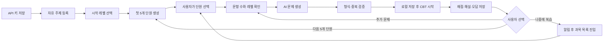
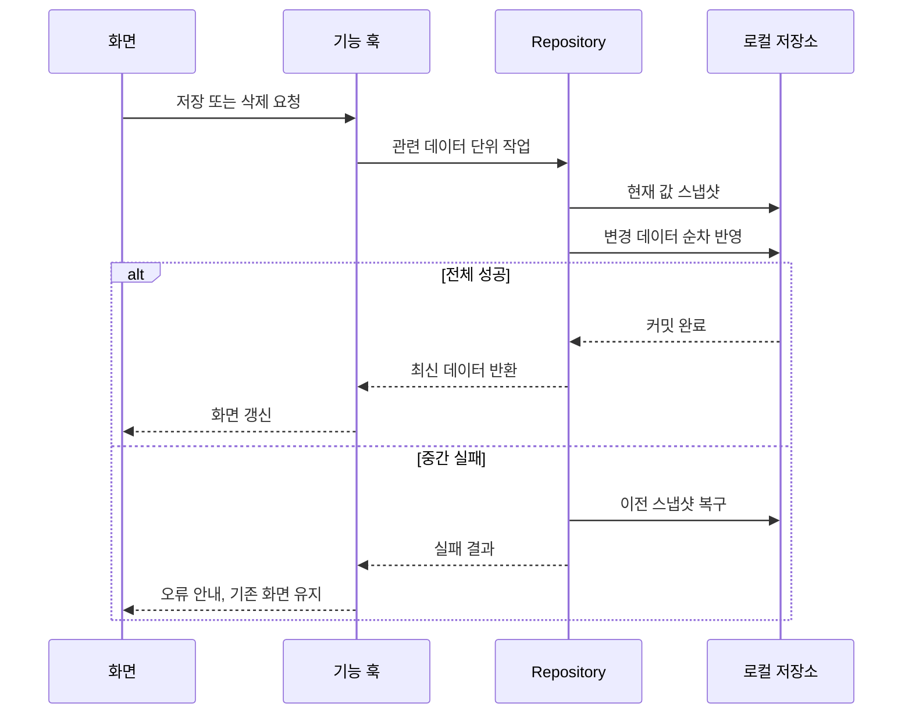
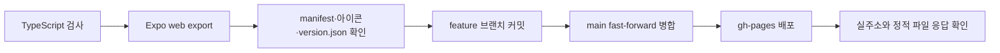

# Celueste v2.1 아키텍처와 워크플로

이 문서는 v2.1.0 코드의 현재 구조, 실제 실행 흐름, 이후 변경 시 지켜야 할 방향을 기록한다.

## 1. 제품 원칙

1. 사용자가 자신의 API 키와 학습 주제를 직접 결정한다.
2. 희귀하거나 예상하지 못한 주제도 학습 대상으로 인정한다.
3. 무의미한 입력과 주제 충돌은 학습 의도를 기준으로 판별해 엉뚱한 출제를 줄인다.
4. Gemini 기본 모델은 3.5이며, Gemini 3.5 미만으로 자동 전환하지 않는다.
5. 문제는 항상 1~4번 4지선다로 생성·검증한다.
6. 난이도는 1~30을 기본 범위로 하고 31 이상도 확장한다.
7. 정답률만으로 레벨을 자동 변경하지 않는다. 다음 단원과 추가 출제는 사용자가 선택한다.
8. 과목·단원·문제·풀이 기록은 로컬에 저장하고, 삭제와 복원은 데이터 일관성을 우선한다.
9. 알림은 학습 재방문을 유도하되 특정 단원이나 문제를 자동 시작하지 않는다.
10. 사용자 문의는 기존 카카오톡 연결을 사용하며 별도 의견 수집 UI를 추가하지 않는다.

## 2. 계층 구조

| 계층 | 주요 파일 | 책임 |
| --- | --- | --- |
| 진입점 | `apps/mobile/App.tsx` | 컨트롤러 생성 후 뷰에 전달 |
| 화면 조합 | `src/components/AppView.tsx` | 학습·자료함·설정·시험 화면과 모달 렌더링 |
| 앱 제어 | `src/hooks/useAppController.ts` | 화면 상태와 기능 훅 조합, 알림 진입 처리 |
| 기능 훅 | `src/hooks/useAppData.ts`, `useQuizGeneration.ts`, `useCurriculumManager.ts`, `useExamSession.ts` | 데이터 로드, 생성, 목차, 시험 세션 흐름 |
| 도메인 | `src/domain/intent.ts`, `difficulty.ts`, `prompts.ts`, `generator.ts` | 사용자 의도·난이도 해석, 프롬프트 구성, 응답 검증 |
| AI 통신 | `src/domain/ai_client.ts` | Gemini 3.5 이상 호출, 제한 시간, 취소, 429 대기 |
| 중복 방지 | `src/domain/question_similarity.ts`, `question_repository.ts` | 신규·기존 문제 유사도 검사와 중복 제외 |
| 동시 생성 방지 | `src/domain/generator.ts` | 동일 생성 요청의 진행 중 Promise 공유와 완료 후 해제 |
| 저장소 | `src/data/db.ts`, `src/data/repositories/*` | 로컬 데이터 읽기·쓰기, 연쇄 삭제, 실패 복구 |
| 플랫폼 | `src/utils/notifications.ts`, `src/integrations/secure_storage.ts`, `src/utils/backupArchive.ts` | 알림, API 키 보관, 백업·복원 |
| 배포 | `apps/mobile/public/*`, `deploy-gh-pages.ps1` | PWA 메타데이터·아이콘·버전과 GitHub Pages 게시 |

`App.tsx`는 기능을 직접 구현하지 않는다. 화면은 `AppView`, 동작 조합은 `useAppController`, 개별 기능은 훅과 도메인·repository에 둔다.

## 3. 사용자 학습 워크플로

## 4. 문제 생성 실행 순서

1. `QuizCountModal`에서 사용자가 문항 수와 목표 레벨을 확인한다.
2. `useQuizGeneration`이 선택한 과목·단원·레벨과 기존 문제를 수집하고 `AbortController`를 준비한다.
3. `intent.ts`와 `difficulty.ts`가 실제 학습 범위와 레벨별 요구 수준을 구성한다.
4. `prompts.ts`가 자유 주제를 보존하면서 1~4번 4지선다 JSON을 요구하는 프롬프트를 만든다.
5. `generator.ts`가 `ai_client.ts`를 호출한다.
   동일한 요청이 이미 진행 중이면 새 통신을 만들지 않고 기존 Promise를 공유한다.
6. `ai_client.ts`는 Gemini 3.5 이상 후보만 사용하고, 요청 취소·25초 제한·429 대기 상태를 처리한다.
7. `generator.ts`가 응답 JSON, 문항 수, 보기 4개, 정답 범위, 해설을 검사한다.
8. `question_similarity.ts`와 `question_repository.ts`가 새 문제끼리와 기존 문제 사이의 과도한 유사 문제를 제외한다.
9. 저장 커밋이 성공한 문제만 CBT에 전달한다. 취소·오류·저장 실패 시 시험을 시작하지 않는다.

AI 생성 대기창은 네 장의 캐릭터 프레임을 왕복 재생하고, 가벼운 부유 동작과 간헐적 회전을 함께 사용한다. 기기의 모션 감소 설정이 활성화되면 모든 캐릭터 동작을 중지한다.

## 5. 자료함 탐색 워크플로

1. 자료함 첫 화면은 카테고리 필터와 과목 목록을 표시한다.
2. 과목을 선택하면 해당 과목의 CBT·삭제·AI 단원 생성·단원 목록만 표시한다.
3. 다른 과목의 단원은 과목 상세에 섞지 않는다.
4. 문제 보관함은 과목 목록 아래의 독립 영역에서 전체 과목·단원을 관리한다.
5. 과목 삭제 후 선택 ID가 사라지면 과목 목록으로 자동 복귀한다.

## 6. 저장과 삭제 워크플로

- 단원 삭제는 단원과 해당 단원의 문제 연결을 함께 처리한다.
- 전체 과목 삭제는 복구할 수 없으므로 사용자 확인 뒤 실행한다.
- 백업 복원은 먼저 스키마를 검사하고, 저장 중 실패하면 기존 데이터 복구를 시도한다.
- API 키는 백업에 포함하지 않는다.

## 7. 알림 워크플로

1. 사용자가 설정에서 요일과 아침·저녁 시간을 정한다.
2. 앱은 권한 상태를 확인하고 로컬 알림을 예약한다.
3. 같은 시간대의 중복 예약과 중복 알림 처리를 막는다.
4. 알림을 누르면 앱의 과목 목록으로 이동한다.
5. 사용자가 학습할 과목·단원을 직접 선택한다.

웹 알림은 브라우저 실행 상태와 운영체제 정책의 영향을 받고, 네이티브 알림은 기기 절전·방해금지 설정의 영향을 받는다.

## 8. 오류 처리 기준

| 상황 | 처리 |
| --- | --- |
| API 키 없음 | 가짜 문제를 만들지 않고 키 등록 안내 |
| 출제 취소 | 현재 요청을 abort하고 저장·시험 시작 차단 |
| 무응답·시간 초과 | 다음 허용 후보를 시도하거나 명시적 실패 안내 |
| Gemini 429 | 대기 시간을 기록하고 연속 재호출 차단 |
| 동일 출제 연속 입력 | 진행 중 요청을 공유해 공급자 호출 1회로 제한 |
| 전송 예외 | 상세 원문은 내부 기록에만 남기고 사용자에게 일반 안내 표시 |
| 잘못된 문제 JSON | 저장하지 않고 응답 오류 안내 |
| 중복 문제만 반환 | 중복 제외 결과를 알리고 빈 시험 시작 차단 |
| 저장 실패 | 성공으로 표시하지 않고 가능한 경우 이전 상태 복구 |
| 단원/과목 삭제 | 영향 범위를 확인창에 표시한 뒤 연관 데이터 처리 |

## 9. 배포 워크플로

`deploy-gh-pages.ps1`은 `buildInfo.ts`의 버전을 `public/version.json`에 반영한 뒤 웹 번들을 생성한다. 배포 후 루트 페이지, `version.json`, `manifest.json`, 파비콘, Android/Apple 아이콘 응답을 확인한다.

## 10. 이후 코드 진행 방향

- 새 기능은 먼저 기존 기능 훅 또는 도메인 책임에 맞는지 판단하고, `App.tsx`에 직접 누적하지 않는다.
- 500줄에 가까워지는 파일은 기능 경계가 명확할 때 컴포넌트·스타일·도메인·출력 유틸리티로 분리한다.
- AI 품질 개선은 특정 주제를 하드코딩하는 방식보다 의도·난이도·검증 규칙을 보강한다.
- 저장 변경은 관련 레코드의 일관성과 실패 복구를 포함해 설계한다.
- 실사용자 의견은 카카오톡으로 접수하고, 재현 가능한 기능 오류와 주제별 품질 의견을 구분해 다음 변경 범위를 결정한다.
- APK 제작과 네이티브 실기기 검증은 별도 요청 범위로 다룬다.
