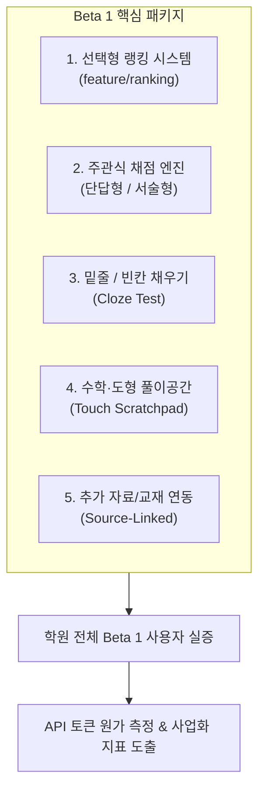

# 🗺️ Celueste (셀루에스테) — 제품 마스터 로드맵 & Beta 1 종합 계획서

> **기준일**: 2026-09-21  
> **프로젝트**: Celueste (AI 맞춤형 자율 학습 및 문제은행 플랫폼)  
> **핵심 슬로건**: *"세상에 문제집이 없는 주제까지, 나만의 지식 체계와 문제은행으로 만들어주는 학습 플랫폼"*

---

## 🧭 1. 제품 핵심 정체성 및 철학 (Core Identity)

### 1-1. "CBT를 넘어, 지식 체계화 문제은행으로"
- 기존의 CBT는 단순히 '이미 출제된 시험을 컴퓨터로 푸는 형식'에 불과합니다.
- Celueste는 학습자가 배우고 싶은 대상이 무엇이든(학술, 자격증, 취미, 실무, 독특한 관심사 등) **AI가 공인된 지식 체계와 5단계 목차를 설계하고, 개인의 수준에 맞는 문제은행을 직접 생성·축적·영구 소장**하게 하는 지식 확장 플랫폼입니다.

### 1-2. 자유 주제 지식 확장의 원리
- 키워드를 단순 나열하는 단답식 출제가 아닌, **상위 개념 ➔ 하위 개념 ➔ 원리 ➔ 실전 응용 ➔ 복합 추론**으로 지식을 확장합니다.
  - *예시*: `"고양이 배변"` 입력 시 ➔ 고양이 배변 정상/이상 상태 ➔ 수분 섭취 및 사료 영향 ➔ 질환 의심 신호 ➔ 소화기계/비뇨기계 지식으로 체계적 확장.
  - *예시*: `"바람의나라 바리스타"` 입력 시 ➔ 교차 충돌 우선순위 원칙에 따라 실제 학습 의도인 커피 원두·추출 메커니즘을 핵심으로 출제.

### 1-3. 로컬 퍼스트(Local-First) & 데이터 주권
- **"내 공부와 문제은행은 온전한 나의 자산이다."**
- 중앙 서버에 종속되지 않고, 과목·단원·문제·오답노트·API 키가 사용자의 로컬 기기(Web IndexedDB / Native AsyncStorage)에 100% 영구 보관됩니다.
- 서버 운영비 0원(BYO API Key 구조)을 실현하며, 생성된 문제은행은 디지털 백업뿐 아니라 **실제 종이 시험지/오답노트 출력**으로 평생 소장할 수 있습니다.

---

## 🎯 2. 학원 전체 실증을 위한 'Beta 1' 핵심 구현 과제

현재 같은 반 학생 중심의 실증 테스트를 거쳐, **학원 전체 사용자 대상으로 테스트를 확장하기 위해 Beta 1 출시 전 반드시 완성해야 할 5대 핵심 기능**입니다.

---

### 📌 [과제 1] 선택형 랭킹 시스템 완성 (`feature/ranking` 브랜치)
* **서버 아키텍처**: Cloudflare Workers + Cloudflare D1 (서버리스 경량 DB).
* **로컬 퍼스트 보호**: 자동 전송이 아니며, 학습자가 **[랭킹 연동]**을 명시적으로 선택했을 때만 최소 식별자 및 점수만 전송. 문제 내용, 개인 교재, API 키는 절대 서버로 전송하지 않음.
* **3대 랭킹 지표**:
  1. **누적 풀이 랭킹**: 30레벨 이하 문제의 총 풀이/완료량 기반
  2. **초고난도 도전 랭킹**: 31레벨 이상 킬러 문항 최고 도달 레벨 기반
  3. **꾸준함(연속 출석) 랭킹**: 하루 최소 3문제 이상 풀이한 연속 학습 일수 기반
* **진행 상태**: `feature/ranking` 브랜치 개발 진행 중 ➔ main 병합 및 Cloudflare 서버 실배포 예정.

---

### 📌 [과제 2 & 3] 주관식 및 밑줄/빈칸 문제 출제·채점 엔진
4지선다 객관식 외에 실제 학습 이해도를 증명할 수 있는 다채로운 문항 형식을 도입합니다.

| 문항 유형 | 출제 및 저장 구조 | 자동 채점 및 평가 원칙 |
| :--- | :--- | :--- |
| **단답형** | 핵심 용어, 공식, 수치 단답 요구 | 대소문자 무시, 공백 정규화, 복수 인정 정답 풀(Synonyms) 일치 검사 |
| **밑줄/빈칸형** | 지문 내 핵심 개념을 `[ (1) ]` 형태로 가림 | 빈칸별 배점 부여, 문맥상 타당한 유사 동의어 인정 |
| **짧은 서술형** | 조건 제시형 2~3문장 설명 요구 | 모범답안 문자열 단순 비교가 아닌 **핵심 키워드 포함 + 논리 조건 충족도 기반 부분점수** 부여 |

#### ⚖️ 서술형 채점 실패 및 모호성 방어 원칙:
- 모호하거나 표현이 달라도 본질적 개념/조건을 충족하면 정답 또는 부분점수 인정.
- AI 채점 통신 실패 시 답안을 안전하게 로컬 보존하고 `자동채점 미완료`로 표시하여 학습 중단 방지.
- 해설 확인 후 답안을 보충한 기록은 최초 응시 점수와 분리 보관.

---

### 📌 [과제 4] 수학 / 도형 / 계산 문제용 인앱 풀이공간 (Scratchpad)
* **목적**: 모바일/태블릿 환경에서 수학 계산, 화학식, 회계 분개, 도형 기하 문제를 풀 때 별도 이면지나 펜 없이 화면 위에서 즉시 계산.
* **구현 방식**:
  - CBT 문제 하단 또는 플로팅 버튼으로 **[✏️ 풀이 공간 열기]** 지원.
  - 문제 지문을 가리지 않는 반투명 오버레이 캔버스 또는 하단 분할 드로잉 패드.
  - 펜 굵기/색상 조절, 지우개, 전체 지우기 기능 제공 (초경량 Canvas API 활용).

---

### 📌 [과제 5] 교사/강사 맞춤형 교재 분석 및 시험지 생성
* **핵심 질문**: *"교사가 직접 만들던 시험과 비슷한 범위·난이도·품질의 시험지를 Celueste가 교재 기반으로 5분 만에 만들 수 있는가?"*
* **지원 포맷**: PDF(구간 선택), TXT, Markdown, DOCX 텍스트 추출.
* **실증 지표**:
  - 기존 수기 시험 제작 시간 vs Celueste 제작 시간
  - 그대로 사용 가능한 문항 비율 / 수정 후 사용 비율 / 폐기 비율
  - 오답 선지(Distractor)의 매력도 및 출제 범위 일치성.

---

## 📊 3. 실증 측정 지표 & AI 원가 분석 계획

학원 전체 Beta 1 기간 동안 단순 방문자가 아닌, **지속 가능한 상용화 지표**를 정밀 측정합니다.

1. **사용자 유지 및 학습 지속성**:
   - 일일 활성 사용자 수(DAU) 및 주간 재방문율
   - 과목 생성자 비율 및 실제 시험 제출 완료율
   - 랭킹 참여율 및 연속 학습(Streak) 유지율
2. **핵심 AI 원가 지표**:
   - **활성 사용자 1명당 월평균 신규 문제 생성량** (풀이 횟수는 로컬 캐시되므로 비용 0원).
   - 문제 1문항당 소비되는 평균 입출력 토큰(Token) 측정.
   - ➔ 향후 유료 모델(월 구독제: 학생 5,900원 / 일반 6,900원 선) 전환 시 손익분기점(BEP) 데이터 확립.

---

## 🛡️ 4. Beta 1 이후 브랜치 운영 및 릴리스 프로토콜

- **main 브랜치**: 배포 가능한 100% 안정 빌드만 유지.
- **feature/* 브랜치**:
  - `feature/ranking`: 랭킹 연동 및 서버 배포
  - `feature/subjective-exam`: 주관식/빈칸형 출제 및 채점 엔진
  - `feature/scratchpad`: 터치 필기 풀이공간
- **검증 게이트**:
  - 모든 기능 병합 전 `cmd.exe /c npx tsc --noEmit` 타입 검사 필수 (에러 0건).
  - Git Tag(`v2.4.0-beta.1` 등)를 발행하여 안정적인 복원 지점 확보.

---

## 🗺️ 5. 단계별 추진 로드맵 요약

| 단계 | 마일스톤 | 핵심 목표 | 상태 |
| :--- | :--- | :--- | :--- |
| **현재 (v2.3.4)** | 문서 최적화 & 로컬 안정화 | 9대 헌법 정렬, IndexedDB 안정화, 불필요 레거시 제거 | **완료** |
| **Step 1** | 랭킹 시스템 완성 | `feature/ranking` 점검, Cloudflare Workers D1 연동, main 병합 | **다음 순서** |
| **Step 2** | 수학 풀이공간 (Scratchpad) | CBT 화면 내 인앱 터치 드로잉 캔버스 컴포넌트 탑재 | 준비 중 |
| **Step 3** | 주관식 & 밑줄/빈칸 엔진 | 4지선다 외 단답형·빈칸형 생성, 의미 기반 부분점수 채점기 | 준비 중 |
| **Beta 1** | 학원 전체 사용자 실증 | Beta 1 패키징, Git Tag 발행, 학생/교사 대상 실증 지표 수집 | 계획 확정 |
