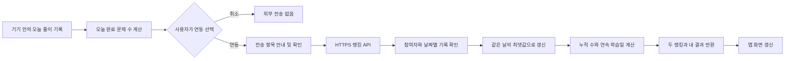

# Celueste 선택형 공동 랭킹 기능 계획서

## 1. 목표

사용자가 자신의 API로 자유로운 주제를 학습하는 현재 구조를 유지하면서, 원하는 사용자끼리 가볍게 학습 동기를 나눌 수 있는 공동 랭킹을 추가한다.

랭킹은 학습의 정확도나 주제 난이도를 평가하지 않는다. 서로 다른 주제와 문제를 풀어도 비교 가능한 아래 두 기록만 사용한다.

- **최다 문제 풀이 왕**: 연동된 일별 완료 문제 수의 누적 합계가 가장 높은 사용자
- **꾸준함 왕**: 하루 3문제 이상 완료한 연속 학습일이 가장 긴 사용자

## 2. 유지할 현재 원칙

- 과목, 단원, 문제, 오답과 풀이 기록은 기존처럼 사용자 기기의 IndexedDB 또는 AsyncStorage에 저장한다.
- 문제 생성은 사용자 자신의 API 키를 사용한다.
- 랭킹 참여는 선택 사항이며 미참여 사용자는 현재 앱 동작이 바뀌지 않는다.
- 전체 학습 데이터나 문제 내용은 공동 서버로 옮기지 않는다.
- 기존 백업·복원과 전체 초기화 흐름을 보존한다.

## 3. 새로 추가할 범위

### 3.1 참여 등록

설정에 `랭킹 참여` 영역을 추가한다. 사용자는 공개할 닉네임을 입력해 참여자를 만든다.

- 닉네임 권장 길이: 2~12자
- 중복 닉네임 불가
- 공백만 있는 값, 금칙어와 운영자 사칭 표현 차단
- 등록 성공 시 기기 인증 정보와 복구 정보를 발급

닉네임만으로는 본인 복구를 증명할 수 없으므로 백업에는 다음 값을 함께 넣는다.

- `rankingNickname`
- `rankingParticipantId`
- `rankingRecoveryToken`

`rankingRecoveryToken`이 포함된 백업 파일은 랭킹 계정을 복구할 수 있는 민감한 파일임을 내보내기 안내에 표시한다. 개인 API 키는 기존처럼 백업에서 제외한다.

### 3.2 오늘 학습 연동

사용자가 버튼을 누르면 아래 확인창을 먼저 표시한다.

**제목**

`오늘 학습 기록 연동`

**안내 문구**

> 연동 시 오늘 완료한 문제 수와 꾸준함 참여 여부만 판별합니다.
>
> 오늘 3문제 이상 풀었다면 꾸준함 기록에도 자동 참여합니다.
>
> 문제 내용, 정답, 과목명과 API 키는 전송하지 않습니다.
>
> 등록한 닉네임은 랭킹에 공개되며 현재 순위에 따라 표시 위치가 변경됩니다.

**버튼**

- `취소`
- `연동하기`

연동 성공 안내는 완료 문제 수에 따라 나눈다.

- 3문제 이상: 오늘 완료 수 반영과 꾸준함 참여를 함께 안내
- 3문제 미만: 완료 수는 반영되며 꾸준함은 3문제부터 인정된다고 안내

### 3.3 랭킹 표시

메인 화면에는 두 항목의 현재 1위만 간결하게 표시한다. 참여 사용자가 연동한 직후에는 자신의 누적 문제 수, 연속 학습일과 현재 순위를 함께 보여준다.

전체 사용자 목록이나 일별 상세 학습 이력은 초기 버전에 넣지 않는다.

## 4. 사용자와 데이터 흐름

자동 백그라운드 전송이나 2시간 단위 일괄 집계는 사용하지 않는다. 사용자가 연동한 요청 안에서 저장과 집계를 끝내고 최신 결과를 반환한다.

## 5. 계산 규칙

### 5.1 완료 문제 수

- 실제로 제출이 완료된 문항만 센다.
- 같은 문제를 같은 풀이 세션에서 중복 제출해도 한 번만 센다.
- 같은 날 다시 연동하면 기존 값에 더하지 않고 `기존 연동 수`와 `현재 기기 수` 중 큰 값을 저장한다.
- 날짜 기준은 서버가 판단한 `Asia/Seoul`의 오늘이다.

### 5.2 꾸준함

- 하루 3문제 이상이면 그날을 유효 학습일로 인정한다.
- 1~2문제는 최다 문제 풀이 누적에는 포함하지만 꾸준함 일수에는 포함하지 않는다.
- 같은 날 2문제 상태로 연동한 뒤 4문제 상태로 다시 연동하면 그날을 유효 학습일로 한 번만 반영한다.
- 연속 학습이 끊긴 뒤 다시 3문제 이상 연동하면 새 연속 기록을 시작한다.

## 6. 실패 처리

- 인터넷이 없거나 서버가 응답하지 않으면 로컬 학습 기록은 영향을 받지 않는다.
- 실패한 연동 요청은 기기에 한 건만 대기시키고, 사용자가 다시 연동하거나 앱이 다음에 열린 뒤 동의를 거쳐 재시도한다.
- 서버 오류를 성공으로 표시하지 않는다.
- 닉네임 충돌, 인증 만료, 비정상 문제 수는 각각 구분된 메시지로 안내한다.

## 7. 구현 단계

1. **문서 확정**: 화면 문구, 계산 규칙, 서버와 미결정 항목 승인
2. **로컬 도메인**: 오늘 완료 수 계산, 참여 상태, 대기 요청과 백업 스키마 추가
3. **서버**: 참여자 등록, 복구, 일별 연동, 랭킹 조회 API와 DB 구성
4. **화면**: 참여 등록, 연동 확인창, 결과 카드와 오류 안내 연결
5. **검증**: 중복 연동, 날짜 경계, 3문제 경계, 복구·탈퇴, 오프라인과 악성 요청 테스트
6. **배포**: 별도 승인 후 서버를 먼저 배포하고 웹앱의 API 주소를 연결

각 단계는 앞 단계 검증 후 진행한다. 랭킹 기능이 실패해도 기존 문제 생성·풀이·저장 기능은 계속 사용할 수 있어야 한다.

## 8. 완료 기준

- 참여하지 않은 사용자의 네트워크 요청이 발생하지 않는다.
- 사용자가 안내창에서 확인한 뒤에만 오늘 기록을 전송한다.
- 서버에 문제 내용, 정답, 과목명과 API 키가 저장되지 않는다.
- 하루 연동을 반복해도 누적 수와 꾸준함 일수가 부풀지 않는다.
- 2문제에서 4문제로 다시 연동하면 완료 수 4와 꾸준함 1일이 반영된다.
- 기기 시각을 바꿔도 서버의 한국 날짜 기준을 우회하지 못한다.
- 백업 복원 후 같은 랭킹 계정을 복구할 수 있다.
- 랭킹 서버 장애가 기존 학습 데이터와 앱 사용을 막지 않는다.
- 탈퇴 시 참여자와 공개 랭킹 데이터의 처리 결과가 사용자에게 명확히 표시된다.

## 9. 초기 범위에서 제외

- 문제 내용, 정답률, 과목, 난이도를 이용한 순위
- 자동 또는 실시간 백그라운드 동기화
- 2시간마다 실행하는 예약 집계 작업
- 전체 사용자의 상세 학습 이력 공개
- 상품, 유료 보상과 경쟁 점수
- 완전한 부정 사용 방지

클라이언트가 보낸 완료 수를 사용하는 구조에서는 조작을 완전히 막을 수 없다. 초기 버전은 중복 방지, 일일 상한, 호출 제한과 이상값 기록으로 과도한 조작을 줄이는 수준으로 운영한다.

## 10. 구현 전 확인할 결정

1. 한 사용자가 두 항목 모두 1위이면 그대로 두 칸에 표시할지, `꾸준함 왕`은 다음 사용자를 표시해 두 명을 보여줄지 결정해야 한다.
2. 닉네임 변경을 허용한다면 변경 주기와 이전 닉네임 보호 기간을 정해야 한다.
3. 탈퇴 즉시 서버 데이터를 삭제할지, 짧은 복구 유예 기간 뒤 삭제할지 정해야 한다.
