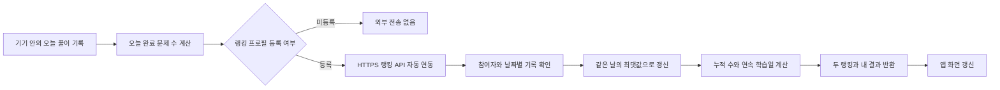

# Celueste 선택형 공동 랭킹 기능 계획서

## 1. 목표

사용자가 자신의 API로 자유로운 주제를 학습하는 현재 구조를 유지하면서, 원하는 사용자끼리 가볍게 학습 동기를 나눌 수 있는 공동 랭킹을 추가한다.

랭킹은 서로 다른 주제와 문제를 풀어도 비교 가능한 아래 세 기록만 사용한다(`PRODUCT_ROADMAP_AND_BETA_PLAN.md` §Beta 1 과제 1).

- **최다 문제 풀이 왕**: 연동된 일별 완료 문제 수의 누적 합계가 가장 높은 사용자
- **꾸준함 왕**: 하루 3문제 이상 완료한 연속 학습일이 가장 긴 사용자
- **초고난도 도전 왕**: 과목별로 31부터 순차 통과한 레벨 중 최고 기록이 높은 사용자. 서로 다른 과목의 객관적인 실력을 비교하는 지표는 아니다.

## 2. 유지할 현재 원칙

- 과목, 단원, 문제, 오답과 풀이 기록은 기존처럼 사용자 기기의 IndexedDB 또는 AsyncStorage에 저장한다.
- 문제 생성은 사용자 자신의 API 키를 사용한다.
- 랭킹 참여는 선택 사항이며 미참여 사용자는 현재 앱 동작이 바뀌지 않는다.
- 전체 학습 데이터나 문제 내용은 공동 서버로 옮기지 않는다.
- 기존 백업·복원과 전체 초기화 흐름을 보존한다.

## 3. 새로 추가할 범위

### 3.1 참여 등록

설정에 `랭킹 참여` 영역을 추가한다. 사용자는 공개할 닉네임을 입력해 참여자를 만든다.

- 닉네임 권장 길이: 2~12자
- 중복 닉네임 불가
- 공백만 있는 값, 금칙어와 운영자 사칭 표현 차단
- 등록 성공 시 기기 인증 정보와 복구 정보를 발급

닉네임만으로는 본인 복구를 증명할 수 없으므로 백업에는 다음 값을 함께 넣는다.

- `rankingNickname`
- `rankingParticipantId`
- `rankingRecoveryToken`

`rankingRecoveryToken`이 포함된 백업 파일은 랭킹 계정을 복구할 수 있는 민감한 파일임을 내보내기 안내에 표시한다. 개인 API 키는 기존처럼 백업에서 제외한다.

### 3.2 오늘 학습 연동

사용자가 버튼을 누르면 아래 확인창을 먼저 표시한다.

**제목**

`자동 학습 기록 연동`

**안내 문구**

> 최초 닉네임 등록 후 시험을 마치면 오늘 완료한 문제 수를 자동으로 연동합니다.
>
> 오늘 3문제 이상 풀었다면 꾸준함 기록에도 자동 참여합니다.
>
> 문제 내용, 정답, 과목명과 API 키는 전송하지 않습니다.
>
> 등록한 닉네임은 랭킹에 공개되며 현재 순위에 따라 표시 위치가 변경됩니다.

연동 결과는 완료 문제 수에 따라 나눈다.

- 3문제 이상: 오늘 완료 수 반영과 꾸준함 참여를 함께 안내
- 3문제 미만: 완료 수는 반영되며 꾸준함은 3문제부터 인정된다고 안내

### 3.3 랭킹 표시와 랭킹 창

랭킹은 기존 학습 화면의 동작을 바꾸지 않도록 **별도의 랭킹 창**에서 처리한다.

**메인 화면**에는 두 항목의 현재 1위만 간결하게 표시한다. 이 카드는 랭킹 창을 여는 진입점이며, 카드 자체에는 참여 등록 입력을 두지 않는다. 랭킹 창에서 돌아오면 카드를 다시 조회해 1위를 갱신한다.

**랭킹 창**에서는 다음을 한곳에서 처리한다.

- 참여 등록 (미참여 상태일 때)
- 오늘 학습 기록 실시간 연동과 그 결과 안내
- 두 항목의 전체 랭킹 목록 확인 (탭 분리, §10-2)
- 내 누적 문제 수, 연속 학습일과 현재 순위
- 랭킹 탈퇴

웹에서는 별도 브라우저 창으로 띄운다. 팝업이 차단되었거나 네이티브 환경이면 앱 안 전체화면으로 대체한다. 랭킹 창은 학습 화면 컨트롤러를 마운트하지 않고 기기 저장소에서 직접 읽으므로, 랭킹 창의 동작이 학습 화면 상태에 영향을 주지 않는다.

일별 상세 학습 이력은 초기 버전에 넣지 않는다.

## 4. 사용자와 데이터 흐름

2시간 단위 일괄 집계는 사용하지 않는다. 등록한 사용자가 시험을 완료한 요청 안에서 저장과 집계를 끝내며, 실패하면 기기에 최신 집계값을 보관해 다음 시험 완료 때 다시 전송한다.

## 5. 계산 규칙

### 5.1 완료 문제 수

- 실제로 제출이 완료된 문항만 센다.
- 같은 문제를 같은 풀이 세션에서 중복 제출해도 한 번만 센다.
- 같은 날 다시 연동하면 기존 값에 더하지 않고 `기존 연동 수`와 `현재 기기 수` 중 큰 값을 저장한다.
- 날짜 기준은 서버가 판단한 `Asia/Seoul`의 오늘이다.

### 5.2 꾸준함

- 하루 3문제 이상이면 그날을 유효 학습일로 인정한다.
- 1~2문제는 최다 문제 풀이 누적에는 포함하지만 꾸준함 일수에는 포함하지 않는다.
- 같은 날 2문제 상태로 연동한 뒤 4문제 상태로 다시 연동하면 그날을 유효 학습일로 한 번만 반영한다.
- 연속 학습이 끊긴 뒤 다시 3문제 이상 연동하면 새 연속 기록을 시작한다.

### 5.3 초고난도 도전

- 1~30은 자유 선택, 각 과목은 31부터 시작한다. 같은 과목·같은 레벨의 서로 다른 3문제를 한 시험에서 제출하고 2문제 이상 맞혀야 통과한다.
- 31 → 32 → 33 순서로 진행하며 다른 과목의 진도를 빌려 건너뛸 수 없다. 실패하면 재도전하고, 이미 통과한 레벨은 복습할 수 있다.
- 혼합 레벨·혼합 과목·3문항이 아닌 시험은 일반 학습으로 보존하되 도전 승급에는 반영하지 않는다.
- 완료된 순차 도전 기록은 Attempt의 선택 필드에 남겨 기존 백업·복원에 포함한다. 구형 고레벨 정답 기록은 소급 승급하지 않는다.
- 전체 과목의 순차 통과 최고값을 연동 직전에 기기에서 계산해 전송한다. 서버는 개별 도전 기록이나 과목을 받지 않는다.
- 서버는 날짜 구분 없이 전체 기간 기준 최댓값(MAX)만 저장한다(최다 문제 풀이·꾸준함과 달리 일별 기록이 없다).
- 더 낮은 레벨을 다시 보내도 기존 최고 도달 레벨은 내려가지 않는다.
- 문제 지문이나 정답은 전송하지 않으며, 전송값은 난이도 레벨(정수)뿐이다.

## 6. 실패 처리

- 인터넷이 없거나 서버가 응답하지 않으면 로컬 학습 기록은 영향을 받지 않는다.
- 실패한 연동 요청은 기기에 한 건만 대기시키고, 사용자가 다시 연동하거나 앱이 다음에 열린 뒤 동의를 거쳐 재시도한다.
- 서버 오류를 성공으로 표시하지 않는다.
- 닉네임 충돌, 인증 만료, 비정상 문제 수는 각각 구분된 메시지로 안내한다.

## 7. 구현 단계

1. **문서 확정**: 화면 문구, 계산 규칙, 서버와 미결정 항목 승인
2. **로컬 도메인**: 오늘 완료 수 계산, 참여 상태, 대기 요청과 백업 스키마 추가
3. **서버**: 참여자 등록, 복구, 일별 연동, 랭킹 조회 API와 DB 구성
4. **화면**: 참여 등록, 연동 확인창, 결과 카드와 오류 안내 연결
5. **검증**: 중복 연동, 날짜 경계, 3문제 경계, 복구·탈퇴, 오프라인과 악성 요청 테스트
6. **배포**: 별도 승인 후 서버를 먼저 배포하고 웹앱의 API 주소를 연결

각 단계는 앞 단계 검증 후 진행한다. 랭킹 기능이 실패해도 기존 문제 생성·풀이·저장 기능은 계속 사용할 수 있어야 한다.

## 8. 완료 기준

- 참여하지 않은 사용자의 네트워크 요청이 발생하지 않는다.
- 사용자가 안내창에서 확인한 뒤에만 오늘 기록을 전송한다.
- 서버에 문제 내용, 정답, 과목명과 API 키가 저장되지 않는다.
- 하루 연동을 반복해도 누적 수와 꾸준함 일수가 부풀지 않는다.
- 2문제에서 4문제로 다시 연동하면 완료 수 4와 꾸준함 1일이 반영된다.
- 기기 시각을 바꿔도 서버의 한국 날짜 기준을 우회하지 못한다.
- 백업 복원 후 같은 랭킹 계정을 복구할 수 있다.
- 랭킹 서버 장애가 기존 학습 데이터와 앱 사용을 막지 않는다.
- 탈퇴 시 참여자와 공개 랭킹 데이터의 처리 결과가 사용자에게 명확히 표시된다.

## 9. 초기 범위에서 제외

- 문제 내용·정답률·과목별 실력을 비교하는 순위 (순차 도전 레벨 지표는 §5.3에 포함)
- 자동 또는 실시간 백그라운드 동기화
- 2시간마다 실행하는 예약 집계 작업
- 전체 사용자의 일별 상세 학습 이력 공개 (순위 목록은 §3.3의 랭킹 창에서 공개한다)
- 상품, 유료 보상과 경쟁 점수
- 완전한 부정 사용 방지

클라이언트가 보낸 완료 수를 사용하는 구조에서는 조작을 완전히 막을 수 없다. 초기 버전은 중복 방지, 일일 상한, 호출 제한과 이상값 기록으로 과도한 조작을 줄이는 수준으로 운영한다.

## 10. 확정된 결정

1. **서버**: 기존 구현은 Cloudflare Workers + D1이다. 2026-09-22 현재 운영 방식 유지/통합 결정과 서버 수정은 사용자 요청으로 보류한다.
2. **동시 1위 표시**: 한 사용자가 여러 항목에서 모두 1위이더라도 `최다 문제 풀이 왕`, `꾸준함 왕`, `초고난도 도전 왕`을 각각 독립된 탭(또는 별도 영역)으로 분리해 표시한다. 세 항목은 서로 다음 순위자로 대체하지 않고, 동일 인물이 여러 탭에 동시에 노출될 수 있다.
3. **탈퇴 정책**: 탈퇴 요청 시 즉시 삭제하지 않고 3일 유예 기간을 둔 뒤 서버에서 참여자와 일별 기록을 삭제한다. 유예 기간 중 재로그인/복구 시 탈퇴 요청은 취소된다.
4. **초고난도 도전 왕 추가**: `PRODUCT_ROADMAP_AND_BETA_PLAN.md` §Beta 1 과제 1에 따라 3번째 지표로 추가한다(§1, §5.3). 킬러 문항 기준은 난이도 31레벨 이상.

닉네임 변경 주기 정책은 여전히 초기 범위 밖이며(§9), `PATCH /participants/me/nickname`은 구현하지 않는다.
