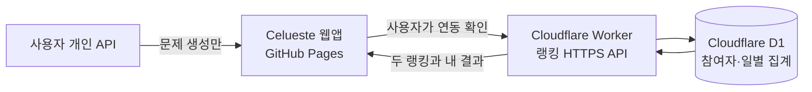

# Celueste 랭킹 서버 선택안

## 1. 필요한 서버 역할

현재 앱의 GitHub Pages는 정적 파일을 배포하고, 각 사용자의 학습 데이터는 기기 안의 IndexedDB 또는 AsyncStorage에 저장한다. 이 구조만으로는 여러 사용자의 기록을 하나의 랭킹으로 합칠 수 없다.

랭킹 서버는 아래 역할만 담당한다.

- 닉네임과 참여자 식별 정보 등록
- 오늘 완료한 문제 수를 중복 없이 저장
- 누적 완료 수와 연속 학습일 계산
- 두 랭킹 1위와 본인 순위 반환
- 백업의 복구 정보로 기존 참여자 복구

문제 생성과 개인 API 호출은 계속 사용자 기기에서 수행한다.

## 2. 선택지 비교

| 방식 | 장점 | 단점 | 판단 |
| --- | --- | --- | --- |
| **Cloudflare Workers + D1** | 별도 PC 없이 HTTPS API 상시 운영, 작은 TypeScript API와 SQLite 방식 SQL에 적합, GitHub Pages와 분리 가능 | Cloudflare 계정과 원격 DB 설정 필요, 서비스 정책에 의존 | **권장** |
| **Supabase Edge Functions + Postgres** | Postgres, 관리 화면, 인증·정책 확장에 유리 | 현재 두 개 랭킹에는 구성 범위가 크고 인증·RLS 설계 항목이 늘어남 | 확장 요구가 커질 때 대안 |
| **노트북 Node API + SQLite + 터널** | 데이터를 직접 관리하고 프로토타입을 빠르게 확인 가능 | 노트북 전원·절전·인터넷·터널 상태에 따라 서비스 중단, 운영 보안과 백업을 직접 관리 | 로컬 시험용만 권장 |

Cloudflare D1은 SQLite의 SQL 방식을 사용하는 관리형 서버리스 데이터베이스이며 Workers에서 직접 연결할 수 있다. Supabase는 관리형 Postgres와 Edge Functions를 제공하므로 향후 회원 계정, 관리자 화면과 복잡한 통계가 필요해지면 적합하다.

## 3. 권장 구성

**권장안은 Cloudflare Workers + D1이다.**

이 기능은 요청 한 번에 작은 JSON을 받고 두세 개 테이블을 갱신하는 정도이므로 별도의 상시 노트북이나 2시간 예약 작업이 필요 없다. 사용자가 `연동하기`를 누른 시점에 Worker가 저장과 랭킹 계산을 끝내면 된다.

GitHub Pages에는 공개 API 주소만 들어간다. DB 접근 권한, 토큰 해시용 비밀값과 운영 키는 Worker의 서버 환경에 둔다.

## 4. 노트북 서버를 주 서버로 권하지 않는 이유

- 노트북이 꺼지거나 절전 상태에 들어가면 연동이 실패한다.
- 집이나 이동 네트워크가 바뀌면 공개 접속 경로가 불안정해질 수 있다.
- HTTPS 인증서, 터널, 방화벽, OS 업데이트와 DB 백업을 직접 관리해야 한다.
- 사용자가 연동하려는 시간과 노트북이 켜진 시간이 맞지 않을 수 있다.

노트북 방식은 API 계약과 화면을 실제 서버 배포 전에 확인하는 개발용 환경으로는 유효하다. 운영 서버가 내려간 경우에는 앱이 학습 기록을 잃지 않고 연동 실패만 안내해야 한다.

## 5. 권장 운영 흐름

1. 로컬 모의 서버로 API 계약과 중복 연동을 검증한다.
2. 승인 후 Cloudflare 계정에 Worker와 D1을 만든다.
3. DB 마이그레이션과 서버 비밀값을 설정한다.
4. 운영 GitHub Pages 주소와 개발 주소만 CORS 허용 목록에 넣는다.
5. 서버에서 등록·복구·중복 연동·3문제 경계·한국 날짜 경계를 검증한다.
6. 웹앱에 운영 API 주소를 연결하고 기능 플래그로 내부 확인한다.
7. 사용자 승인 후 서버와 웹앱을 순서대로 배포한다.

현재 문서 단계에서는 Cloudflare 프로젝트 생성, 결제 정보 등록, 서버 배포와 GitHub Pages 변경을 수행하지 않는다.

## 6. 비용과 확장 판단

초기에는 닉네임, 날짜와 정수 집계만 저장하므로 저장량과 요청량이 작다. 다만 무료 한도와 요금은 서비스 정책에 따라 바뀔 수 있으므로 실제 서버 생성 직전에 공식 요금과 한도를 다시 확인한다.

다음 요구가 생기면 Supabase 또는 별도 관리 서버로 재평가한다.

- 이메일·소셜 로그인
- 관리자용 신고·제재 화면
- 전체 순위와 기간별 통계
- 여러 기기의 실시간 동기화
- 학습 그룹과 초대 기능

## 7. 보안과 개인정보 기준

- 공개 닉네임 외 개인 학습 내용을 서버로 보내지 않는다.
- 복구 토큰과 기기 토큰은 충분히 긴 무작위 값으로 만들고 서버에는 해시만 둔다.
- 연동 API는 참여자·IP 단위 호출 제한과 일일 상한을 적용한다.
- CORS는 브라우저 접근 범위를 줄이는 설정이며 인증을 대신하지 않는다.
- 운영 로그에는 토큰, 요청 원문과 개인 학습 내용을 남기지 않는다.
- DB 백업과 탈퇴 데이터 삭제 정책을 구현 전에 확정한다.

## 8. 공식 참고 문서

- [Cloudflare Workers 문서](https://developers.cloudflare.com/workers/)
- [Cloudflare D1 문서](https://developers.cloudflare.com/d1/)
- [Supabase Edge Functions 문서](https://supabase.com/docs/guides/functions)
- [Supabase Database 문서](https://supabase.com/docs/guides/database/overview)
